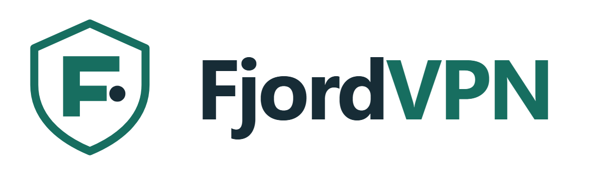

<p align="center">
  <picture>
    <source media="(prefers-color-scheme: dark)" srcset="static/brand/fjordvpn-logo-light.png">
    
  </picture>
</p>

<p align="center">Flere Proton VPN-forbindelser. Ét lokalt overblik.<br>
Upload WireGuard-konfigurationer, se offentlige adresser og videresend TCP-trafik til dine tjenester.</p>

## Installér i FjordHub

FjordVPN er en app i [FjordHub](https://github.com/qlerup/fjordhub).

1. Opdatér appkataloget, og vælg **FjordVPN → Installér**.
2. Vælg web-port (standard **8098**), lokalnet i CIDR-format og datamappe.
3. Åbn appen fra FjordHub. SSO logger dig ind med din FjordHub-bruger.
4. Vælg **Ny VPN**, og upload en ny Proton WireGuard `.conf` med **NAT-PMP** slået til.
5. Vælg eventuelt et lokalt TCP-mål og start forbindelsen, når du er klar.

Kun FjordVPN-administratorer eller FjordHub-administratorer med appadgang får
adgang. FjordHub er loginmyndighed; lokale konti bruges ikke i en administreret
installation. Fjernet adgang og rolleændringer kontrolleres løbende.

Installationen opretter **ingen VPN-profiler** og starter **ingen VPN-tunnel**.
Eksisterende VPN-installationer på andre servere berøres ikke.

## Krav

- Linux med Docker og Docker Compose v2.
- Docker-værten skal have `/dev/net/tun` og understøtte `NET_ADMIN` i containere.
- Proton VPN-konfiguration med WireGuard, IPv4-server og NAT-PMP/port forwarding.
- Et privat IPv4-lokalnet, som ikke overlapper Protons `10.2.0.0/24`.

FjordHub kontrollerer TUN-adgang i Docker under installation af FjordVPN. Med
FjordHubs Proxmox-forbindelse opsættes manglende adgang automatisk for FjordHubs
egen LXC og bevares efter genstart. Den aktive LXC behøver ikke genstartes.

Ved installation uden FjordHub skal TUN være givet videre til den LXC, som kører Docker.
På Proxmox-versioner med device passthrough kan en **ledig** `devN`-plads bruges,
fx `pct set <CTID> --dev0 /dev/net/tun`, hvis `dev0` ikke allerede er optaget.
Genstart derefter den berørte LXC på et passende tidspunkt. FjordVPN ændrer
ikke Proxmox-konfigurationen og genstarter ikke andre servere.

## Selvstændig Docker-installation

Land og flag følger Protons offentliggjorte [geofeed](https://ip.me/static/geofeeds/geofeed-mm.csv)
for den aktive offentlige IP. Det er VPN-placeringen og ikke en påstand om
serverens fysiske placering. Listen caches i seks timer; hvis IP'en ikke kan
identificeres, vises landet som ukendt frem for et gæt fra en anden GeoIP-database.

```sh
git clone https://github.com/qlerup/fjordvpn.git
cd fjordvpn
cp .env.example .env
# Ret DATA_DIR til en absolut sti og LAN_SUBNETS til dit lokalnet.
docker compose up -d --build
```

Åbn `http://SERVER-IP:8098`. Det første login er `admin`; en tilfældig adgangskode
gemmes lokalt i `DATA_DIR/initial-login.txt`. Der er ingen standardadgangskode.
Lad både `FJORDHUB_URL` og `FJORDHUB_API_KEY` være tomme ved selvstændig drift.

| Indstilling | Formål |
|---|---|
| `APP_PORT` | Webport, standard 8098 |
| `DATA_DIR` | Absolut værtssti til private VPN-konfigurationer og tilstand |
| `LAN_SUBNETS` | Tilladte private IPv4-net, kommaadskilt |
| `UI_ALLOWED_HOSTS` | Valgfri liste med domæner og IP'er; tom accepterer lokalnet-IP'er |
| `FJORDHUB_URL`, `FJORDHUB_API_KEY` | Udfyldes automatisk af FjordHub |

## Forbindelser og videresendelse

Hver profil får sin egen Gluetun-container og et TCP-relay i samme
netværksnamespace. Dashboardet forbliver tilgængeligt, selv om en VPN er slukket.
En profil kan sende den offentlige Proton-port til ét lokalt `IP:port`-mål.
En reverse proxy på målet kan fordele HTTPS-trafik mellem flere tjenester.

Relayet lukker ved et mislykket VPN-healthcheck og følger ændringer i den
tildelte port. Den lokale servers øvrige udgående trafik ændres ikke.
IPv6 udelades fra importerede profiler. OpenVPN og UDP-relay indgår ikke.
DNS og HTTPS-certifikater administreres separat; IP/port kan skifte hos Proton.

Brug ikke samme Proton-nøgle i to aktive installationer. Appen afviser dubletter
blandt sine egne profiler, men har ingen adgang til andre VPN-servere. Brug
separate konfigurationer, mens gamle installationer stadig kører.

## Data, stop og afinstallation

`DATA_DIR` indeholder private nøgler, profiler og loginoplysninger. Beskyt backup
af denne mappe. Den monteres med samme værtssti i de enkelte VPN-containere.
Nøgler vises ikke i API-svar, browseren eller fejlbeskeder. Uploads fortolkes
strengt som konfiguration; shell-hooks og ekstra sektioner afvises.

I Docker/FjordHub stopper appens nedlukning også dens egne VPN-containere.
Den ønskede tænd/sluk-tilstand gemmes, så profiler genoptages ved opstart.
Appens børnecontainere er mærket med dens Compose-projekt. Afinstallation via
FjordHub fjerner runtime med `down --remove-orphans`, men bevarer data og nøgler.
`docker compose down --remove-orphans` gør det samme ved manuel drift.

Dashboardet har adgang til Docker-socket og skal behandles som administration
af Docker-værten. Brug det på et betroet lokalnet; sæt HTTPS og adgangskontrol op
før eventuel ekstern eksponering. Docker-data og UI har ingen Proxmox-nøgle.

Den alternative systemd-installation i `deploy/` kan bruges på en dedikeret LXC.
Her stopper stop af UI-servicen kun UI'et; sluk profiler i appen for også at stoppe
tunnelerne. Brug aldrig systemd og Docker-udgaven på samme datamappe samtidig.

## Ikoner og logoer

[Brandmappen](static/brand/) indeholder originale SVG-logoer til lys/mørk
baggrund, et transparent symbol, PNG-appikoner fra 16 til 1024 px, favicon og
webmanifest. De kan gendannes med `python tools/build_brand.py`.

## Udvikling og test

```sh
python -m venv .venv
.venv/bin/pip install -r requirements.txt
.venv/bin/pip install pytest playwright pillow
.venv/bin/playwright install chromium
.venv/bin/pytest tests -q
.venv/bin/python tests/browser_check.py
```

Tests dækker upload, validering, dubletter, login/CSRF, FjordHub-SSO og
adgangstilbagekaldelse, adskilte Docker-ressourcer og værtssti-mapping.
Browserkontrollen bruger syntetiske profiler ved desktop- og mobilbredde.
Pakkeinstallation og oprydning kontrolleres isoleret uden at starte en VPN.
